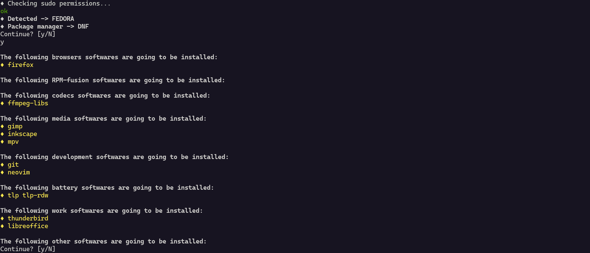

# 🐧 Post-installer
This simple script allows you to install all the needed software after the first boot into your new Linux distribution.
It recognize the distribution and selects from the available software list the appropriate one. 

You have just to select what to install and enjoy a good ☕

### How to use it:

To run the script you have just to
1. `clone` the repository or download the `.zip`
2. Edit the `JSON` file dedicated to your distribution changing the boolean values of the software you are interested in
3. **Optional**: Add more software in a `JSON` compatible format
4. Run the `main.py` **with sudo privileges**
5. Enjoy!

---

**Currently under development**
